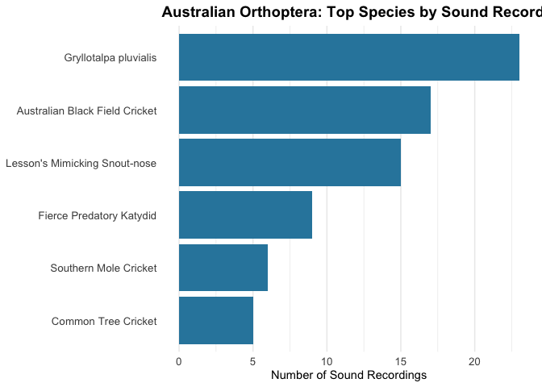

<!-- README.md is generated from README.Rmd. Please edit that file -->

# EcoacousticUtilities

<!-- badges: start -->

[](https://github.com/wcornwell/ecoacoustic_utilities/actions/workflows/R-CMD-check.yaml)
[](https://app.codecov.io/gh/wcornwell/ecoacoustic_utilities?branch=main)
<!-- badges: end -->

Utilities for downloading and analyzing ecoacoustic data from
iNaturalist and the Atlas of Living Australia (ALA).

## Installation

You can install the development version of EcoacousticUtilities from
GitHub:

``` r
# install.packages("devtools")
# devtools::install_github("wcornwell/ecoacoustic_utilities")
```

## Functions

### iNaturalist Functions

- **`get_inat_sounds()`** - Download sound recordings from iNaturalist
  - **Use case**: Download actual audio files for a specific taxon
  - With `download=FALSE`: Get quick count of total observations with
    sounds
  - With `download=TRUE`: Download up to N audio files to local
    directory
- **`get_inat_species_summary()`** - Get species-level summary of sound
  recordings
  - **Use case**: Identify which species have the most recordings in a
    taxon/region
  - Returns data.frame with counts per species (taxon_id,
    scientific_name, common_name, n_recordings)
  - Useful for finding well-documented species before downloading
- **`plot_inat_species_summary()`** - Visualize species summary data
  - **Use case**: Create publication-ready plots of species recording
    counts
  - Horizontal bar chart with customizable colors and labels

### ALA Functions

- **`get_ala_sounds()`** - Download sound recordings from the Atlas of
  Living Australia (ALA)
  - **Use case**: Download high-quality research recordings from ALA
    nodes
  - Automatically handles various metadata formats and unique file
    naming
  - Efficiently limits searches to avoid API timeouts
- **`get_ala_circle_occurrences()`** - Download occurrence records
  within a circular area

### Utility Functions

- **`biggest_files()`** - Find the largest files in a directory
- **`find_duplicate_wavs()`** - Detect duplicate WAV files by content
  hash
- **`training_dataset_summary()`** - Comprehensive analysis of audio
  training datasets

## Example Usage

``` r
library(EcoacousticUtilities)

# Find largest files in a directory
big_files <- biggest_files("/path/to/directory", n = 20)

# Find duplicate WAV files
duplicates <- find_duplicate_wavs("/path/to/audio/library")
```

### iNaturalist Workflow

``` r
# 1. Quick check: How many sound recordings exist?
n_sounds <- get_inat_sounds(
  "Turnix maculosus",
  place_name = "Australia",
  download = FALSE # Just get the count
)
print(n_sounds) # e.g., 450

# 2. Which species have the most recordings?
species_summary <- get_inat_species_summary(
  taxon_name = "Orthoptera", # All crickets/grasshoppers
  place_name = "Australia",
  min_recordings = 5 # Only species with 5+ recordings
)
print(species_summary)

# 3. Visualize the results
plot_inat_species_summary(species_summary, top_n = 15)

# 4. Download actual audio files for a specific species
get_inat_sounds(
  "Turnix maculosus",
  place_name = "Australia",
  target_n = 100,
  download = TRUE, # Download files
  quality = "research"
)
```

### Example: Australian Orthoptera

Here’s a real example analyzing cricket and grasshopper recordings in
Australia:

``` r
library(EcoacousticUtilities)
#> galah: version 2.1.2
#> ℹ Default node set to ALA (ala.org.au).
#> ℹ See all supported GBIF nodes with `show_all(atlases)`.
#> ℹ To change nodes, use e.g. `galah_config(atlas = "GBIF")`.
library(ggplot2)

# Get species with at least 5 recordings
orth_summary <- get_inat_species_summary(
  taxon_name = "Orthoptera",
  place_name = "Australia",
  min_recordings = 5
)
#> Processing page 1 (154 observations)
#> No more results at page 2.

# View top species
head(orth_summary, 10)
#>    taxon_id         scientific_name                    common_name n_recordings
#> 1    623017   Gryllotalpa pluvialis                           <NA>           23
#> 7    397920   Teleogryllus commodus Australian Black Field Cricket           17
#> 3    701931 Pseudorhynchus lessonii  Lesson's Mimicking Snout-nose           15
#> 11   894013    Hexacentrus mundurra       Fierce Predatory Katydid            9
#> 5    569917   Gryllotalpa australis          Southern Mole Cricket            6
#> 6    633763      Oecanthus angustus            Common Tree Cricket            5

# Create visualization
plot_inat_species_summary(
  orth_summary,
  top_n = 15,
  title = "Australian Orthoptera: Top Species by Sound Recordings"
)
```



### ALA Workflow

``` r
# Configure ALA email (required for galah)
library(galah)
galah_config(email = "your.email@example.com")

# 1. Download sounds for a specific species
get_ala_sounds(
  "Notaden bennettii",
  target_n = 10,
  include_taxon_name = TRUE
)

# 2. Get ALA occurrences within a radius
birds <- get_ala_circle_occurrences(
  taxon = "Aves",
  lat = -33.7,
  lon = 151.3,
  radius_km = 10,
  email = "your.email@example.com"
)
```

### Training Dataset Analysis

``` r
# Analyze an audio training dataset
summary <- training_dataset_summary("/path/to/audio/dataset")
print(summary) # Shows class distribution, file types, sizes, durations, outliers
```

## License

MIT © Z Cornwell
